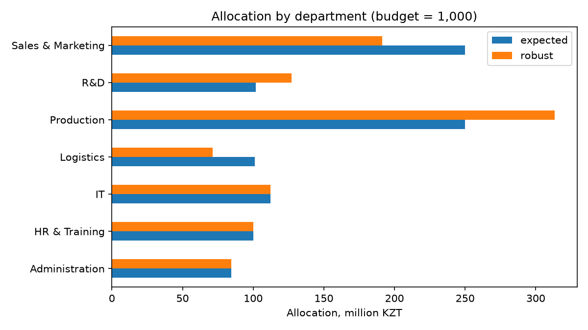
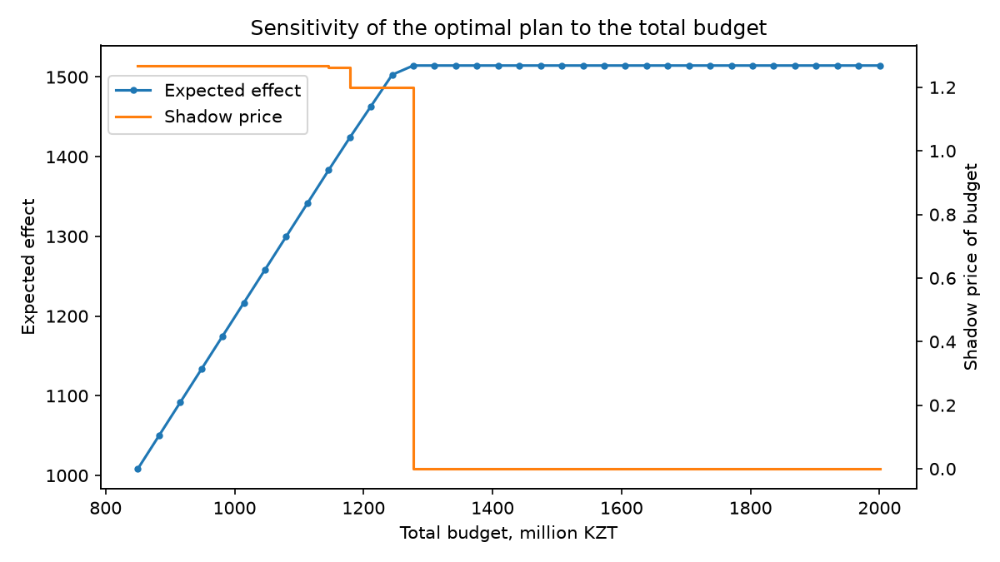

# Enterprise Budget Optimization

[](https://github.com/maxatzhax/budget-optimization/actions/workflows/tests.yml)
[](LICENSE)
<!-- ZENODO_BADGE -->

Linear programming models that allocate an enterprise budget across items and departments under economic uncertainty, comparing expected-value and robust (max-min) decision criteria.

## Research context

This repository contains the code for my master's thesis **"Modeling of Enterprise Budget Optimization Processes"**
(«Моделирование процессов оптимизации бюджета предприятия»), Information Systems programme,
L.N. Gumilyov Eurasian National University, Astana, Kazakhstan.

The thesis asks how a company should split a limited budget between departments and expense items when
the payoff of each item depends on the economic scenario (recession / stable / growth). The code:

- formulates budget allocation as a linear programme with item bounds, mandatory expenses and department share limits;
- solves it under three decision criteria: single scenario, **expected value** (Bayes) and **robust max-min** (Wald);
- reports the **shadow price of the budget** and how the optimal plan changes as the total budget grows.

The full mathematical formulation is in [`docs/model.md`](docs/model.md).

## Installation

Requires Python 3.10+.

```bash
git clone https://github.com/maxatzhax/budget-optimization.git
cd budget-optimization
python -m venv .venv && source .venv/bin/activate   # Windows: .venv\Scripts\activate
pip install -r requirements.txt
```

## Usage

Solve the model for a budget of 1,000 million KZT with the robust criterion:

```bash
python -m budget_opt.cli --budget 1000 --method robust
```

Run the full experiment (all criteria + budget sensitivity), which writes tables and figures to `results/`:

```bash
python scripts/run_experiment.py --budget 1000
```

From Python:

```python
from budget_opt import load_problem, solve_robust

problem = load_problem("data/sample/budget_items.csv", "data/sample/departments.csv", total_budget=1000)
plan = solve_robust(problem)
print(plan.by_department(problem))
```

Run the tests: `pytest`.

## Example results (synthetic data, B = 1,000)

Effect of each plan when the given scenario actually happens:

| Plan (criterion) | Recession | Stable | Growth | Worst case |
|---|---:|---:|---:|---:|
| Optimised for stable economy | 1170.8 | **1201.5** | 1232.2 | 1170.8 |
| Expected value (p = 0.3 / 0.5 / 0.2) | 1170.8 | **1201.5** | 1232.2 | 1170.8 |
| **Robust (max-min)** | 1194.1 | 1194.1 | 1194.1 | **1194.1** |

The robust plan gives up 0.6% of the effect in a stable economy to secure +2% in a recession, shifting
money from pro-cyclical items (sales bonuses, warehousing) to cost-saving ones (quality control, process automation).

| Allocation by department | Sensitivity to total budget |
|---|---|
|  |  |

More analysis (regret matrix / Savage criterion) is in [`notebooks/01_criteria_comparison.ipynb`](notebooks/01_criteria_comparison.ipynb).

## Data

`data/sample/` contains a **synthetic** dataset (20 budget items, 7 departments) generated by
`scripts/generate_synthetic_data.py`; it does not describe any real company.
The real enterprise data used in the thesis are confidential and not published. The input format and how to
run the models on your own data are described in [`data/README.md`](data/README.md).

## Repository structure

```
├── src/budget_opt/      models (model.py), data loading & validation (data.py), CLI
├── scripts/             experiment and data generation scripts
├── data/                sample data; raw/ and processed/ are git-ignored
├── notebooks/           exploratory analysis
├── results/             generated tables and figures
├── docs/                mathematical formulation
└── tests/               pytest test suite
```

## How to cite

If you use this code, please cite it using the metadata in [`CITATION.cff`](CITATION.cff)
(GitHub: **Cite this repository** button in the sidebar).

<!-- ZENODO_CITATION -->

## License and contact

Code is released under the [MIT License](LICENSE).

Maksat Zhaxalykov · [ORCID](https://orcid.org/0009-0001-0799-9836) · [zhaxalykov_ma@enu.kz](mailto:zhaxalykov_ma@enu.kz)
